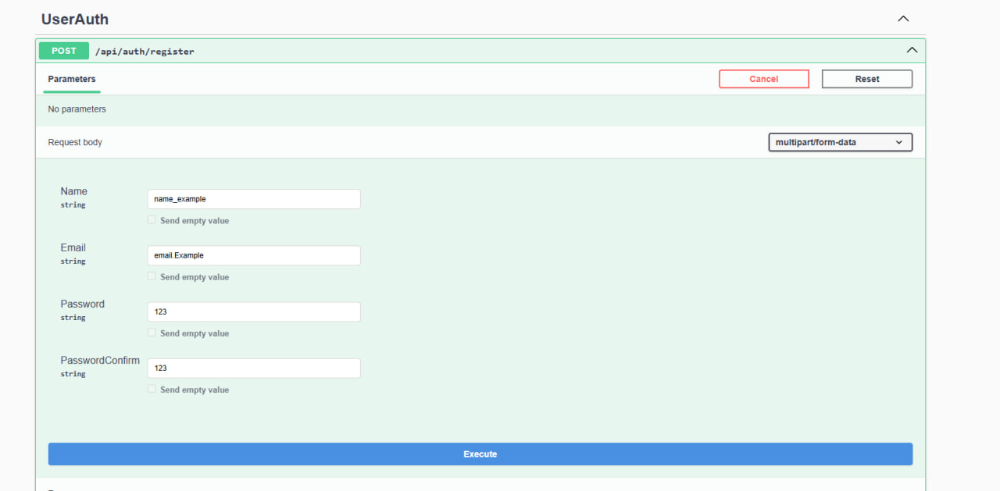
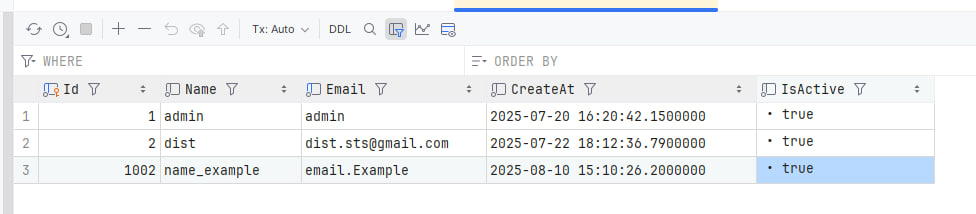
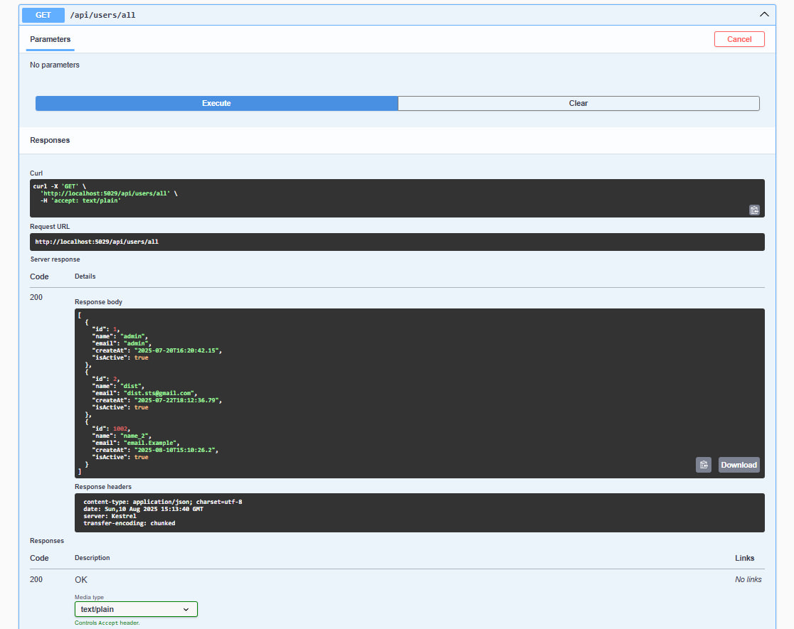
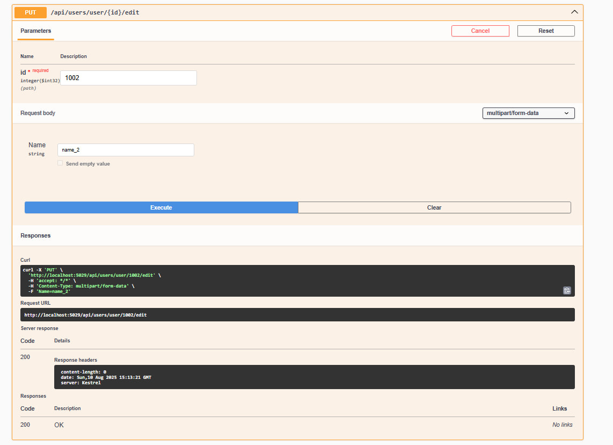
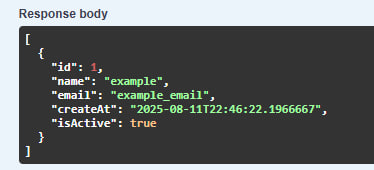
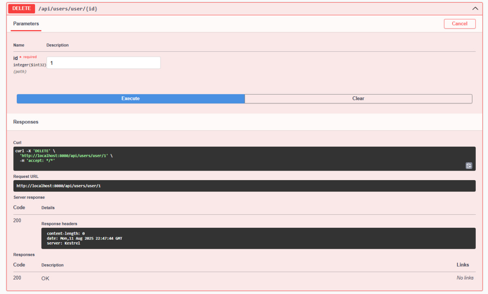
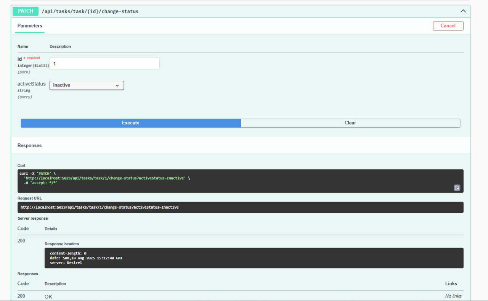

# 📝 TaskManager

## 📌 Project Description  
This project is designed for **task management**, demonstrating a system similar to those used in real companies, where team members receive tasks they must complete.  
It is created for **convenient task data viewing**, **tracking progress**, and **easy sorting**.

## 🚀 Features  
- 📋 Create, edit, and delete tasks  
- 👥 Assign tasks to team members  
- 🔍 Filter and sort tasks by different parameters  
- 🗂 Sort tasks by categories  
- 📅 Track deadlines and task statuses

## 🛠 Technologies  
- **C# .NET** — main backend language  
- **Entity Framework Core** — ORM for database operations  
- **SQL Server** — relational database  
- **ASP.NET Core Web API** — for REST endpoints  
- **JWT Token Authentication** — secure user authentication and authorization  
- **Docker** — containerized environment  
- **Clean Architecture** — layered project structure  
- **SOLID Principles** — maintainable and scalable codebase  
- **Serilog** — logging and error tracking  
- **AutoMapper** — object-to-object mapping  
- **BCrypt** — password hashing and security

## ⚙️ Installation & Run  

### 🔹 Local run
1. **Clone the repository**  
   ```bash
   git clone https://github.com/your-username/TaskManager.git
   cd TaskManager
   ```

2. **Configure the database connection and JWT settings**
   Open the appsettings.json file and set your own values:
   ```bash
   {
    "Logging": {
      "LogLevel": {
        "Default": "Information",
        "Microsoft.AspNetCore": "Warning"
      }
    },
    "AllowedHosts": "*",
    "ConnectionStrings" : {
      "Connection" : "Server=localhost,YOU_HOST;Database=YOU_DATABASE;User Id=sa;Password=YourStrong!Passw0rd;TrustServerCertificate=true;"
    },
    "JwtOptions" : {
      "TokenSecret" : "YOU_TOKEN_SECRET",
      "ExpiresHours" : "YOU_EXPIRES_HOURS"
    }
   }
   ```
  ⚠ Make sure that the database is running locally (you can use SQL Server or a Docker container).
  Replace YourStrong!Passw0rd and TokenSecret with your own secure values.


## 🐳 Docker Setup  

This project can be run entirely in Docker with **SQL Server** and the **TaskManager API** as separate containers.  

### Create `docker-compose.yml`  
In the root folder of your project, create a `docker-compose.yml` file:  

```yaml
version: '3.8'

services:
  sqlserver:
    image: mcr.microsoft.com/mssql/server:2022-latest
    container_name: taskManagerSql
    environment:
      ACCEPT_EULA: "Y"
      MSSQL_SA_PASSWORD: "YOU_STRONG_PASSWORD"
    ports:
      - "1433:1433"
    volumes:
      - sqlserverdata:/var/opt/mssql
        
  taskManager:
    build:
      context: .
      dockerfile: Dockerfile
    container_name: taskManager-container
    ports:
      - "8080:8080"
    depends_on:
      - sqlserver
    environment:
      - ASPNETCORE_ENVIRONMENT=Development
      - ConnectionStrings__Connection=Server=taskManagerSql,1433;Database=YOU_DATABASE_NAME;User Id=sa;Password=YOU_STRONG_PASSWORD;TrustServerCertificate=true;

volumes:
  sqlserverdata:
```

## 📸 Screenshots

### Swagger main page
.png)

### Example request POST: Register user



### Example request GET: Get all tasks


### Example request GET: Get all users


### Example request PUT: Change username


Before:


### Example request DELETE: Delete user


### Example request PATCH: Change task status


## Contacts
- Developer: Dmytro Stozhok  
- GitHub: [https://github.com/dist22](https://github.com/dist22)
